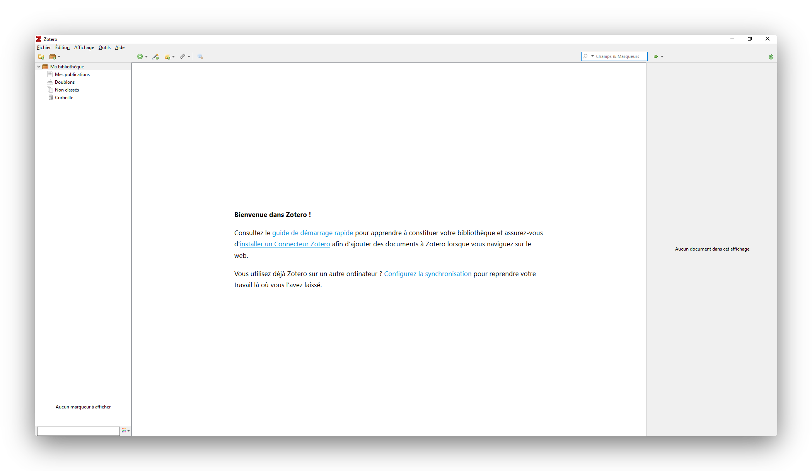
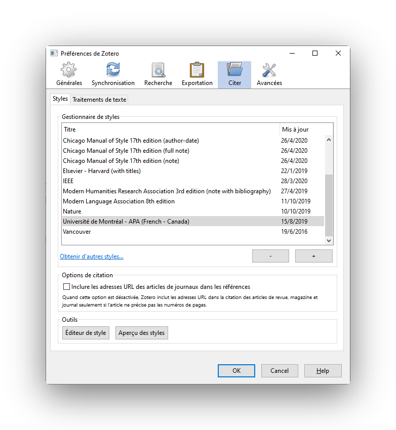
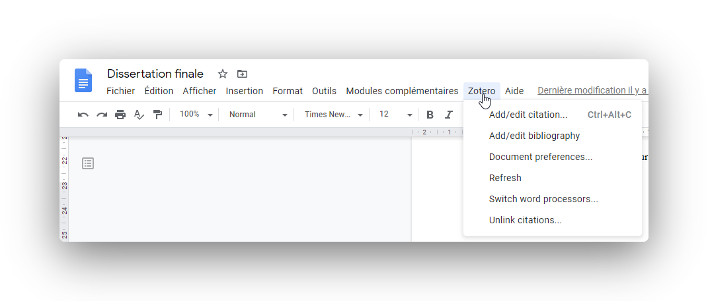
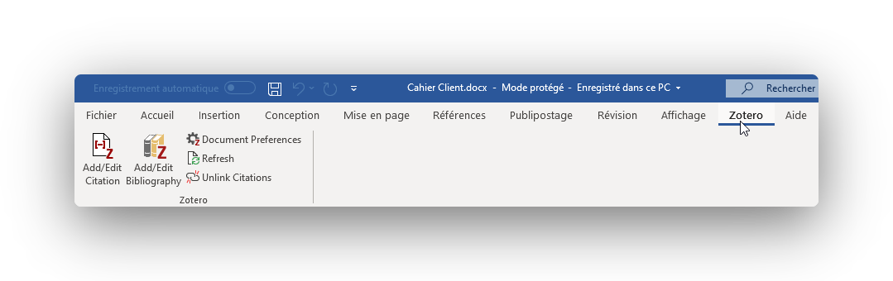

# Configuration

Zotero est divisé en plusieurs composantes, ils ne sont pas tous obligatoire, mais ils seront tous couverts par ce guide : la bibliothèque, le connecteur web, le connecteur texte et l'application mobile. Le guide passera au travers de toutes les étapes pour configurer Zotero et utiliser les différentes composantes selon votre préférence.

## 1. Créez votre compte

Commencez d'abord par vous créer un compte gratuit sur le [site web de Zotero](https://www.zotero.org/user/register). Ce compte vous permettra de synchroniser votre bibliothèque entre vos appareils et collaborer pour des projets en équipe.

## 2. Téléchargez la bibliothèque

La bibliothèque est l'endroit où sera entreposé toutes vos sources. Elle est disponible sur Windows, Mac ou Linux. Vous pouvez la téléchargez à partir de la page suivante : [https://www.zotero.org/download/](https://www.zotero.org/download/). Prenez l'option de droite, soit **Zotero 5.0**.


N'installez pas la bibliothèque sur un ordinateur de l'école! Suivez plutôt les instructions pour [utiliser le connecteur avec la bibliothèque en ligne](utilisation-en-solo.md#utilisez-le-connecteur-avec-la-bibliotheque-en-ligne).


Une fois téléchargé et installé, la bibliothèque vous accueillera. Cliquez sur **Configurez la synchronisation** pour ouvrir les préférences de Zotero où vous pourrez entrer vos identifiants. Ne quittez pas la fenêtre des préférences, nous en auront besoin pour la prochaine étape!

## 3. Configurez la bibliothèque

Pour les menus Synchronisation, Générales, Recherches et Avancées les options par défaut conviennent.

Sous le menu **Citer**, vous devriez voir le **Gestionnaire de styles**. C'est ici qu'il faut choisir le bon style bibliographique, soit la 6e édition de l'APA, tel que discuté dans l'[introduction](./#quels-sont-les-regles-de-bibliographies-a-lithq). Cliquez sur **Obtenir d'autres styles** puis recherchez le style `Université de Montréal - APA (French - Canada)`. Une fois sélectionnez, il devrait se trouver dans la liste, comme le montre la capture d'écran ci-dessous.

## 4. Téléchargez le connecteur web

Le connecteur web permet d'enregistrer facilement vos pages web dans votre bibliothèque. Dans une bonne partie des cas, l'auteur et la date de publication seront prise en compte \(s'il y a lieu\). Le connecteur web est disponible pour Chrome, Firefox et Safari, ainsi que tout autre navigateur à l'aide d'un marque-page.

Rendez-vous sur la page suivante pour installer le connecteur web : [https://www.zotero.org/download/connectors](https://www.zotero.org/download/connectors).

Le connecteur n'a pas besoin de configuration supplémentaire, il effectuera automatiquement le lien avec la biliothèque Zotero.

## 5. Téléchargez le connecteur texte

Le connecteur texte est optionnel et dans la plupart des cas il n'offre pas d'avantage significatif. Il effectue la liaison entre la bibliothèque et votre éditeur de texte \(Google Docs, Microsoft Word ou LibreOffice\). 

### Pour Google Docs

Aucune installation nécessaire, il est intégré avec le connecteur web. Sur chaque document, un menu Zotero devrait apparaître.

### Pour Microsoft Word et LibreOffice

Normalement, le connecteur texte pour Word s'installera automatiquement avec l'installation de la bibliothèque Zotero. Si ce n'est pas le cas, il faut se rendre dans la bibliothèque Zotero, sous le menu **Édition** puis **Préférences**. Rendez-vous dans la section **Citer** et l'onglet **Traitements de texte** où vous aurez l'option pour installer le connecteur texte \(ou module\) pour Word et LibreOffice. Une fois installé, un menu Zotero devrait apparaître dans votre éditeur de texte.

