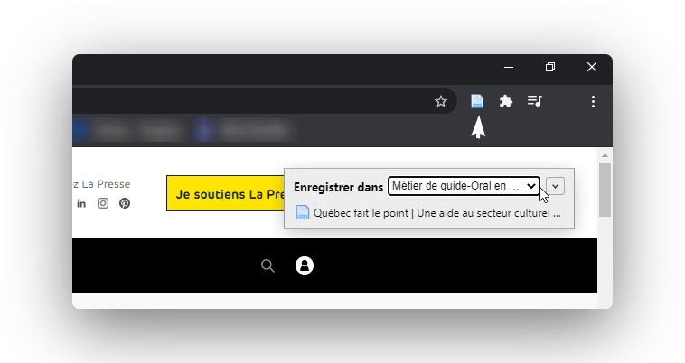
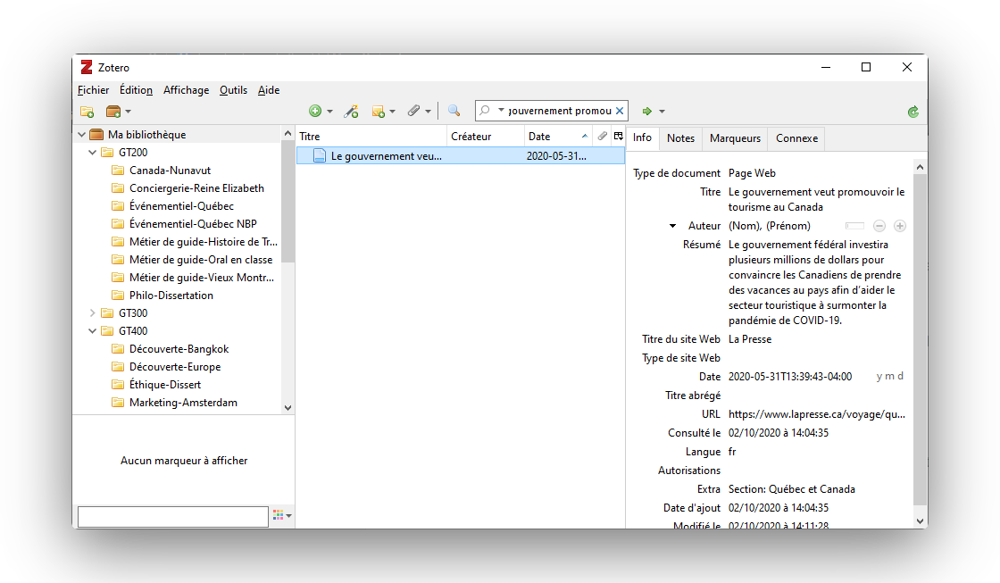

# Utilisation en solo

### Utilisez le connecteur

Avant de sauvegarder, assurez-vous que la bibliothèque Zotero est ouverte. Lorsque vous trouvez une page à sauvegarder, cliquez sur l'icône Zotero, normalement situé à droite de la barre d'adresse.


L'icône de Zotero change selon le type détecté du document \(page web, vidéo, PDF, etc.\)


En cliquant, le document s'enregistre automatiquement dans votre bibliothèque. Utilisez le menu sélecteur ou la flèche pour décider dans quel dossier ira le document \(optionel\).

### Ajoutez de l'information manquante

Dans certains cas, [La Presse](https://www.lapresse.ca/voyage/quebec-et-canada/2020-05-31/le-gouvernement-veut-promouvoir-le-tourisme-au-canada) étant un bon exemple, certains champs ne sont pas importés automatiquement \(l'auteur et la date\). Retournez dans Zotero pour voir si il y a des champs manquants, si oui, ajoutez-les. Si vous ne les conaissez pas, laissez les champs vides.

### Ajoutez une source de citation

Théoriquement, un élément dans la bibliographie doit obligatoirement se retrouver en citation au préalable. Pour obtenir une source de citation, faites un clique droit sur le document, et cliquez sur **Créer une citation/bibliographie**. Sélectionnez :

* Le style **Université de Montréal - APA \(French Canada\);**
* Le mode de création **Citations**;
* La méthode de création **Copier dans le presse-papiers**;

Vous pouvez maintenant coller la citation dans votre travail. Voici un exemple avec [l'article de La Presse](https://www.lapresse.ca/voyage/quebec-et-canada/2020-05-31/le-gouvernement-veut-promouvoir-le-tourisme-au-canada) :

> \(Berthiaume, 2020\)

### Ajoutez une bibliographie

À la fin de votre travail, sélectionnez tous les documents de votre travail. Faites un clique droit et cliquez sur **Créer une citation/bibliographie**. Sélectionnez :

* Le style **Université de Montréal - APA \(French Canada\);**
* Le mode de création **Bibliographie**;
* La méthode de création **Copier dans le presse-papiers**;

Vous pouvez maintenant coller la bibliographie dans votre travail. Voici un exemple avec [l'article de La Presse](https://www.lapresse.ca/voyage/quebec-et-canada/2020-05-31/le-gouvernement-veut-promouvoir-le-tourisme-au-canada) :

> Berthiaume, L. \(2020, 31 mai\). Le gouvernement veut promouvoir le tourisme au Canada. La Presse. [https://www.lapresse.ca/voyage/quebec-et-canada/2020-05-31/le-gouvernement-veut-promouvoir-le-tourisme-au-canada](https://www.lapresse.ca/voyage/quebec-et-canada/2020-05-31/le-gouvernement-veut-promouvoir-le-tourisme-au-canada)


Zotero s'occupera automatiquement de mettre les sources dans le bon ordre alphabétique!


